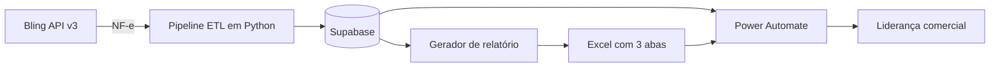

# Automação de Relatórios Diários de Faturamento

> Case de automação que transforma notas fiscais do Bling em indicadores diários e planilhas executivas para a liderança comercial.

## Sobre o projeto

Este projeto resolve uma necessidade real: consolidar diariamente o faturamento e disponibilizar os dados à liderança comercial de forma rápida, padronizada e confiável.

A solução conecta **Bling**, **Supabase** e **Excel**. Ela consulta notas fiscais de saída e entrada, transforma e persiste os dados, calcula o faturamento líquido e gera uma planilha pronta para consumo. Uma automação complementar no **Microsoft Power Automate** coleta os resultados e os arquivos e os envia diretamente à liderança comercial.

Assim, um processo operacional recorrente se torna um pipeline reproduzível, com menos manipulação manual e mais agilidade no acompanhamento do negócio.

## Resultado entregue

- Consolidação diária de vendas, entradas e devoluções;
- cálculo automático do faturamento líquido;
- centralização dos dados fiscais no Supabase;
- atualização idempotente com `upsert`, evitando duplicidade;
- Excel automático com visão executiva e dados detalhados;
- execução atual, histórica ou agendada;
- distribuição por um fluxo complementar no Power Automate.

## Arquitetura



Este repositório cobre **Bling → Supabase → Excel**. A distribuição é realizada pela automação complementar no Power Automate.

## Relatório gerado

A aplicação cria `relatorios_excel/Vendas_Diarias_AAAA_MM_DD.xlsx` com:

| Aba | Conteúdo |
| --- | --- |
| **Resumo Geral** | Quantidade e valor de vendas, entradas/devoluções e faturamento líquido |
| **NF-e de Saída** | Notas, clientes, valores, frete, desconto e chave da NF-e |
| **NF-e de Entrada** | Entradas/devoluções, origem, valores e dados fiscais |

```text
Faturamento líquido = total das notas de saída - total das notas de entrada
```

## Decisões de engenharia

- **API REST:** Bling v3 com autenticação, paginação e renovação de token;
- **ETL:** separação de extração, transformação e carga;
- **persistência:** Supabase como fonte centralizada e histórica;
- **idempotência:** `upsert` permite reprocessamentos seguros;
- **robustez:** paginação e intervalo entre chamadas da API;
- **arquitetura modular:** integração, ETL e relatório separados;
- **segurança:** credenciais em variáveis de ambiente;
- **flexibilidade:** execução manual por data ou agendada;
- **orientação ao negócio:** dados técnicos convertidos em informação executiva.

## Tecnologias

Python 3 · Bling API v3 · Supabase · Pandas · OpenPyXL · Requests · Schedule · python-dotenv · Microsoft Power Automate

## Estrutura

```text
config/settings.py           # Configurações de ambiente
core/bling_client.py         # Integração com o Bling
core/etl.py                  # Pipeline ETL
core/excel_generator.py      # Geração do Excel
core/supabase_client.py      # Persistência no Supabase
scripts/                     # Apoio à autenticação
tests/                       # Scripts de validação
main.py                      # Orquestração ponta a ponta
schendule.py                 # Agendamento diário
```

## Como executar

Pré-requisitos: Python 3.10+, acesso à API v3 do Bling, projeto Supabase com as tabelas esperadas e credenciais válidas.

```bash
python -m venv .venv
pip install -r requirements.txt
```

Copie `.env.example` para `.env` e preencha:

```env
SUPABASE_URL="sua_url"
SUPABASE_KEY="sua_chave"
BLING_ACCESS_TOKEN="seu_access_token"
BLING_REFRESH_TOKEN="seu_refresh_token"
BLING_CLIENT_ID="seu_client_id"
BLING_CLIENT_SECRET="seu_client_secret"
```

> Nunca versione o arquivo `.env` ou exponha credenciais reais.

```bash
python main.py                       # Processa a data atual
python main.py --data 2026-07-24    # Processa uma data específica
python schendule.py                  # Inicia a rotina agendada
```

O agendador dispara diariamente às `17:45`, processando o dia anterior, e precisa permanecer em execução.

## Valor como case

Este projeto vai além da criação de uma planilha: combina engenharia de software, integração de sistemas e entendimento do negócio. Ele evidencia minha capacidade de:

- traduzir uma necessidade de negócio em uma solução ponta a ponta;
- integrar APIs e serviços de nuvem;
- estruturar pipelines de dados reutilizáveis;
- reduzir atividades manuais por meio de automação;
- entregar informação adequada ao público executivo;
- combinar Python e ferramentas low-code em um único processo.

## Próximas evoluções

- Logs estruturados e alertas de falha;
- retentativas para erros transitórios;
- testes unitários com mocks;
- horário, fuso e tabelas parametrizáveis;
- dashboard histórico e execução em serviço gerenciado.

---

Desenvolvido como solução aplicada a um processo real de acompanhamento diário de faturamento e suporte à decisão comercial.
